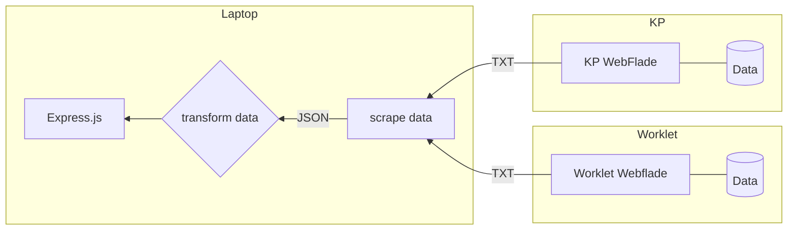

# 👣 Automatisk håndtering af tilskud til fodterapi

| [**Afhængigheder**](#afhængigheder) | [**Metoder**](#metoder) | [**Dataflow**](#dataflow) | [**Ressourcer**](#ressourcer) |

 

## Afhængigheder

> **Note**
> 
> Forudsætninger for afvikling -->
> 
> | [Node.js 18](https://docs.npmjs.com/downloading-and-installing-node-js-and-npm)  |  [Node-RED 3.0.2](https://nodered.org/docs/getting-started/windows)  |   [Puppeteer 18.2.1](https://www.npmjs.com/package/puppeteer/v/18.2.1)
> 
> Nødvendige netværksadgange under afvikling -->
> 
> | https://cdn.jsdelivr.net/npm  |  https://jsbin-user-assets.s3.amazonaws.com/rafaelcastrocouto/  | https://cdnjs.cloudflare.com/ajax  |
> 
> | https://workletnew.snapp.dk/  | https://fagsystem.kommunernespensionssystem.dk/spk-fagsystem/ |

 

## Metoder

- (**E**xtract) - Data scrapes fra webfladen af [Kommunernes Pensionssystem](https://fagsystem.kommunernespensionssystem.dk/spk-fagsystem/) med [Node-Red](https://nodered.org) og [Pupeteer](https://pptr.dev/)
- (**T**ransform) - Data vaskes og filteres med et sæt JSONata transformationer i [Node-Red](https://nodered.org)
- Udstilles på Express.js webflade indbygget i Node-RED

 

## Dataflow

### Ressourcer

🔗 Projekt: https://github.com/orgs/Randers-Kommune-Digitalisering/projects/1
