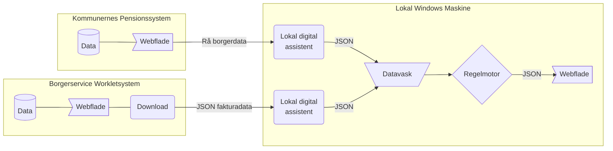

# 👣 Automatisk håndtering af tilskud til fodterapi
|  [**Beskrivelse**](#beskrivelse)  |  [**Afhængigheder**](#afh%C3%A6ngigheder)  |

### Beskrivelse

Automatiseringsløsningen er opbygget som løst koblet arkitektur hvor data styres igennem en række komponenter der er simple at vedligeholde og udskifte. 

- Først tilgår en digital assistent Borgerservice systemet *Worklet* og downloader nye tilgængelige fakturaer. 
- Derfter tilgår en digital assistent *Kommunernes Pensionssystem* og forsøger at lave en rå kopi af tekst-elementer i brugerfladen, på de pågældende borgere fra fakturalisten.
- Derefter vaskes rådata, således data normaliseres og gøres maskinelt læsbart. 
- Derefter bliver data sendt til en regelmotor konfigureret med forretningsregler besluttet af forvaltningen. 
- Til sidst beregnes nødvendige handlinger for hver faktura, herunder oprettelse af sager, tilføjelse af ydelser og beregning tilskudsbeløb . Forslagene udstilles som beslutningsstøtte til en sagsbehandler på en webflade.

### Afhængigheder
Løsningen er afhængig af en række :gear: software komponenter og en række :cloud: netværksadgange til eksterne ressourcer for at fungere.

:gear: | [Node.js 18](https://docs.npmjs.com/downloading-and-installing-node-js-and-npm)  |  [Node-RED 3.0.2](https://nodered.org/docs/getting-started/windows)  |   [Puppeteer 18.2.1](https://www.npmjs.com/package/puppeteer/v/18.2.1) | [Browserless](https://hub.docker.com/r/browserless/chrome) |

:cloud: |   https://cdn.jsdelivr.net/npm  |  https://cdnjs.cloudflare.com/ajax/ | https://unicons.iconscout.com/ | https://fonts.googleapis.com/

:cloud: | https://workletnew.snapp.dk/  | https://fagsystem.kommunernespensionssystem.dk/spk-fagsystem/ |
