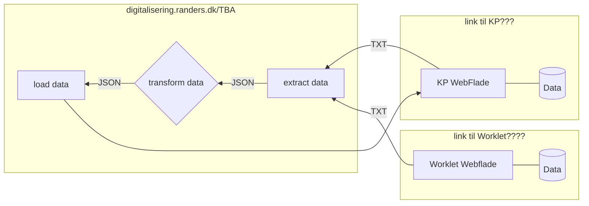

# :control_knobs: auto-tilskudsberegning-fodterapi

A modern, enterprise-ready business intelligence web application.

[**Afhængigheder**](#afhængigheder) |
[**Metoder**](#metoder) |

## Afhængigheder

- [Node.js 18 og NPM](https://docs.npmjs.com/downloading-and-installing-node-js-and-npm)
- [Node-RED 3.0.2](https://nodered.org/docs/getting-started/windows)
- Puppeteer ^18.2.1
- Puppeteer Core ^18.2.1

  

### :clipboard: Metoder

- Fase 1. (**E**xtract) - Data trækkes fra KP WEB(link??) med [Node-Red](https://nodered.org) og [Pupeteer](https://pptr.dev/)
    
- Fase 2. (**T**ransform) - Data vaskes og filteres med et sæt JSONata transformationer i [Node-Red](https://nodered.org)

- Fase 3. (**L**oad) - Data indsættes i KP WEB(Link) med  [Node-Red](https://nodered.org) og [Pupeteer](https://pptr.dev/)

  

### ![flow-icon] Dataflow

  

### ![link-icon] Ressourcer
- Projekt: ???

[automation-icon]: https://api.iconify.design/material-symbols/autopay.svg?height=48&color=orange
[clipboard-icon]: https://api.iconify.design/line-md/clipboard-list.svg?height=36
[flow-icon]: https://api.iconify.design/carbon/flow-data.svg?height=36
[link-icon]: https://api.iconify.design/carbon/copy-link.svg?height=36
