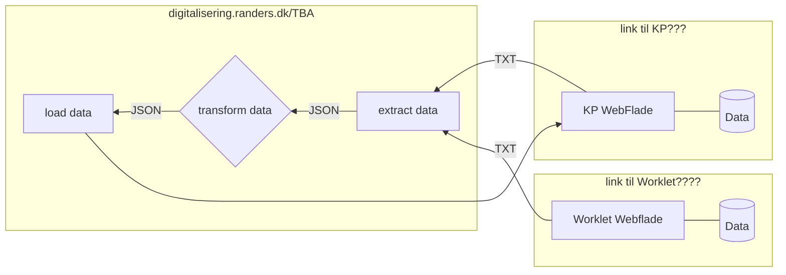

# ![automation-icon] auto-tilskudsberegning-fodterapi

* Beskrivelse??

  

### ![clipboard-icon] Metoder

- Fase 1. (**E**xtract) - Data trækkes fra KP WEB(link??) med [Node-Red](https://nodered.org) og [Pupeteer](https://pptr.dev/)
    
- Fase 2. (**T**ransform) - Data vaskes og filteres med et sæt JSONata transformationer i [Node-Red](https://nodered.org)

- Fase 3. (**L**oad) - Data indsættes i KP WEB(Link) med  [Node-Red](https://nodered.org) og [Pupeteer](https://pptr.dev/)

  

### ![flow-icon] Dataflow

  

### ![link-icon] Ressourcer
- Projekt: ???

[automation-icon]: https://api.iconify.design/material-symbols/autopay.svg?height=48
[clipboard-icon]: https://api.iconify.design/line-md/clipboard-list.svg?height=36
[flow-icon]: https://api.iconify.design/carbon/flow-data.svg?height=36
[link-icon]: https://api.iconify.design/carbon/copy-link.svg?height=36
