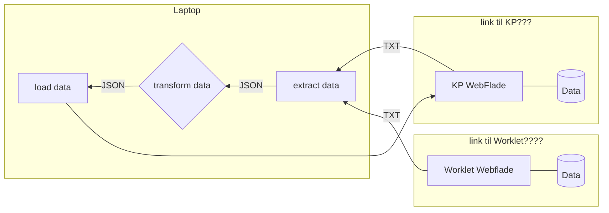

# ⚙ auto-tilskudsberegning-fodterapi

Automatisk håndtering af tilskud til fodterapi

[**Afhængigheder**](#afhængigheder) | [**Metoder**](#metoder) | [**Dataflow**](#dataflow) |

## Afhængigheder

| Forudsætniger for afvikling                                                        | Adgangskrav under afviklingen                                             | col3 |
| ----------------------------------------------------------------------------------- | ------------------------------------------------------------------------------ | ---- |
| [Node.js 18 og NPM](https://docs.npmjs.com/downloading-and-installing-node-js-and-npm) | https://cdn.jsdelivr.net/npm/bootstrap@5.2.3/dist/css/bootstrap.min.css        |      |
| [Node-RED 3.0.2](https://nodered.org/docs/getting-started/windows)                     | https://cdn.jsdelivr.net/npm/bootstrap@5.2.3/dist/js/bootstrap.bundle.min.js   |      |
| [Puppeteer 18.2.1](https://www.npmjs.com/package/puppeteer/v/18.2.1)                   | https://cdn.jsdelivr.net/npm/bootswatch@4.5.2/dist/sandstone/bootstrap.min.css |      |
|                                                                                     | https://cdn.jsdelivr.net/npm/bootswatch@4.5.2/dist/sandstone/bootstrap.min.css |      |
|                                                                                     | https://jsbin-user-assets.s3.amazonaws.com/rafaelcastrocouto/password.ttf      |      |
|                                                                                     | https://cdnjs.cloudflare.com/ajax/libs/font-awesome/6.2.1/css/all.min.css      |      |
|                                                                                     | https://workletnew.snapp.dk/                                                   |      |
|                                                                                     | https://fagsystem.kommunernespensionssystem.dk/spk-fagsystem/                  |      |

## Metoder

- Fase 1. (**E**xtract) - Data trækkes fra KP WEB(link??) med[Node-Red](https://nodered.org) og[Pupeteer](https://pptr.dev/)
- Fase 2. (**T**ransform) - Data vaskes og filteres med et sæt JSONata transformationer i[Node-Red](https://nodered.org)
- Fase 3. (**L**oad) - Data indsættes i KP WEB(Link) med[Node-Red](https://nodered.org) og[Pupeteer](https://pptr.dev/)

 

## Dataflow

### Ressourcer

- 🔗 Projekt: https://github.com/orgs/Randers-Kommune-Digitalisering/projects/1
