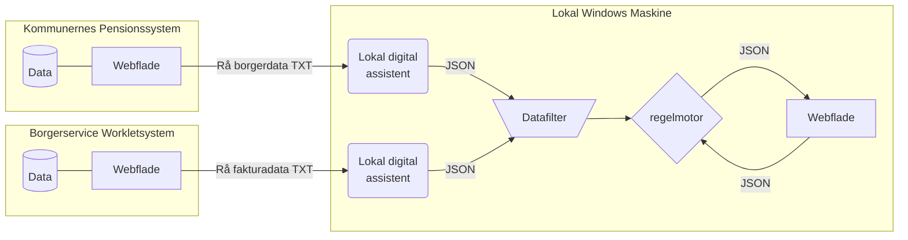

# 👣 Automatisk håndtering af tilskud til fodterapi

| [**Beskrivelse**](#beskrivelse) | [**Afhængigheder**](#afh%C3%A6ngigheder) | [**Ressourcer**](#Ressourcer)

### Beskrivelse

Automatiseringsløsningen er opbygget som løst koblet arkitektur hvor data styres igennem en række komponenter der er simple at vedligeholde og udskifte. 

Først tilgår to digitale assistenter Borgerservice systemet *Worklet* og *Kommunernes Pensionssystem* og forsøger at lave en rå kopi af tekst-elementer i brugerfladen. De rå tekstdata sendes det igennem et datafilter, der forsøger at normalisere og vaske de rå data. Kommer data brugbart ud af filteret, bliver det sendt igennem en regelmotor der kan konfigureres med forretningsregler og til sidst bliver der til berretigede borgere beregnet et forslag til en tilskudsbeløb. Forslagene udstilles som beslutnings støtte til en sagsbehandler på en webflade.

### 

### Afhængigheder

**Tekniske forudsætninger**

:gear: | [Node.js 18](https://docs.npmjs.com/downloading-and-installing-node-js-and-npm)  |  [Node-RED 3.0.2](https://nodered.org/docs/getting-started/windows)  |   [Puppeteer 18.2.1](https://www.npmjs.com/package/puppeteer/v/18.2.1)

**Nødvendige netværksadgange**

:cloud: | https://cdn.jsdelivr.net/npm  |  https://jsbin-user-assets.s3.amazonaws.com/rafaelcastrocouto/  | https://cdnjs.cloudflare.com/ajax  |

:cloud: | https://workletnew.snapp.dk/  | https://fagsystem.kommunernespensionssystem.dk/spk-fagsystem/ |

 

### Ressourcer

Projekt

:cloud: |  https://github.com/orgs/Randers-Kommune-Digitalisering/projects/1 |
