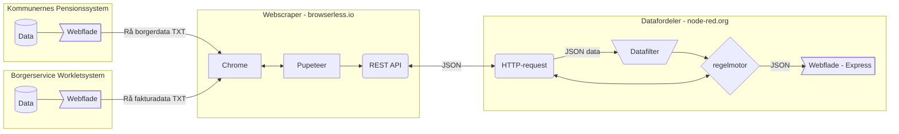

```mermaid

flowchart LR

subgraph Borgerservice Workletsystem
WLDB & WLWEB
end

subgraph Kommunernes Pensionssystem
KPDB & KPWEB
end

subgraph Datafordeler - node-red.org
H(HTTP-request) -->|JSON data| F[\Datafilter/]-->T{regelmotor} -->|JSON| UI>Webflade - Express]
end

subgraph Webscraper - browserless.io
Chrome<-->Pupeteer-->
blAPI(REST API)
end

KPDB[(Data)] --- KPWEB>Webflade] -->|Rå borgerdata TXT| Chrome
WLDB[(Data)] --- WLWEB>Webflade] -->|Rå fakturadata TXT| Chrome
blAPI <--->|JSON| H
T <--> H
```
